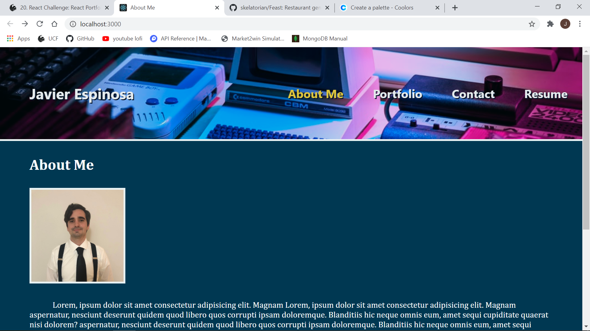

# Portfolio Built w/ React

## Description: 
Checkout my previous work in this stylish webpage I designed myself using React to keep it a Single Page Apllication!   

## Technologies Used:

* Javascript
* HTML5
* CSS3
* React

 

## Usage:
Checkout the deployed site at the link below!

https://jespi116.github.io/React-Portfolio/
  

## Screenshot:

## License:

This project is licensed under the MIT license.
  

## Questions:

If you have any questions about the repo, open an issue or contact me directly at Jespi116@fiu.edu. you can find more of my work at [Jespi116](https://github.com/Jespi116)
